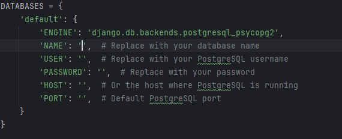
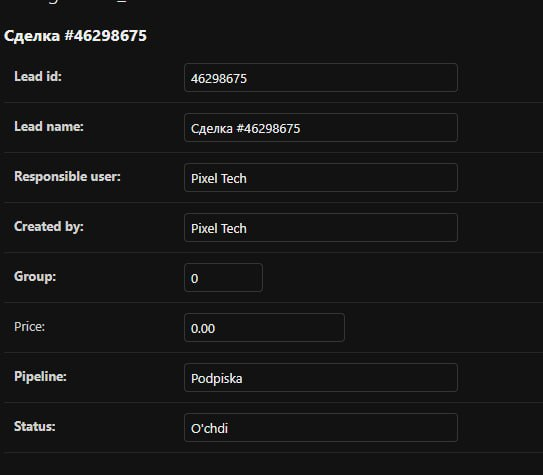

# Add Database
<h3>Enter <strong style="color:green">'CRM_analys/config/settings'</strong> file location<h3>

# And write your postgresql(or other dbs) details to this part


# Install requirements
```shell
pip install -r requirements
```

# Make and migration app
```shell
python manage.py makemigrations crm
python manage.py migrate
```

# The last use true AmoCRM account subdomain and api url.Just go to the amocrm docs
## Open two terminal for run files.First go to <strong style="color:green">'CRM_analys/services'</strong> folder

## And run need files

<strong style="color:red">Open and Write in first terminal</strong>
```shell
python bot.py
```
<strong style="color:red">Open and Write in second new terminal</strong>
```shell
python status.py
```

<h3><i>In conclusion:this project get real-time statuses of leads in your amocrm account.Also you can change your access tokens via bot.The bot give information about leads added or not</i></h3>
<<<<<<< HEAD
# The result in db


=======
## The result in db


>>>>>>> 8766a126495e995f82a67573b414b168899e91b1
